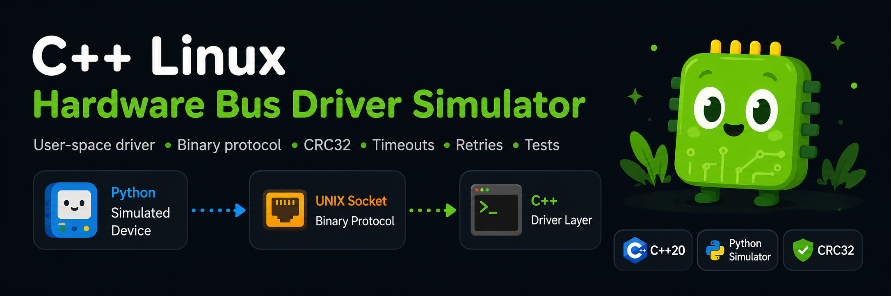

# C++ Linux Hardware Bus Driver Simulator


*Banner generate by ChatGPT*

A C++20 Linux-oriented user-space driver project that communicates with a simulated hardware peripheral over a binary UART/I2C/SPI-like command protocol.

The project is designed as a technical portfolio project for C++ / Linux / hardware-interaction roles. It demonstrates a clean `DeviceDriver` abstraction, a binary frame protocol, CRC validation, timeouts, retries, logs, mocks, unit tests, integration tests, CMake and CI/CD.

## Why this project exists

Industrial C++ roles in aerospace, telemetry, defense or embedded systems often require more than application-level programming. A developer must understand how to communicate with devices, validate binary protocols, handle timeouts, recover from CRC errors, and build software that remains testable without always having the physical hardware available.

This project answers that need with a reproducible simulator:

```text
Python simulated device  <---- UNIX socket / UART-like binary protocol ---->  C++ Linux driver layer
```

The UNIX domain socket is used as a development-friendly transport. The code is structured so the transport can later be replaced by a real serial port, SPI/I2C adapter, or hardware interface.

## Features

- C++20 `DeviceDriver` abstraction.
- Python simulated hardware peripheral.
- Binary command/response protocol.
- Big-endian frame encoding.
- CRC32 validation.
- Sequence number matching.
- Timeout and retry policy.
- Mock transport for unit testing.
- UNIX domain socket transport for Linux integration.
- Device-like commands: ping, read register, write register, read sensor, get status, reset.
- Structured logs.
- CMake + CTest.
- GitHub Actions CI.
- Integration smoke test that launches the simulator and drives the C++ CLI.

## Repository layout

```text
cpp-linux-hardware-bus-driver-simulator/
├── include/lhbd/
│   ├── core/DeviceDriver.hpp
│   ├── protocol/FrameCodec.hpp
│   ├── transport/ITransport.hpp
│   └── utils/Logger.hpp
├── src/
│   ├── apps/device_cli.cpp
│   ├── core/DeviceDriver.cpp
│   ├── protocol/FrameCodec.cpp
│   ├── transport/UnixSocketTransport.cpp
│   └── utils/Logger.cpp
├── simulator/device_simulator.py
├── tests/test_main.cpp
├── scripts/run_integration_test.py
├── docs/
│   ├── ARCHITECTURE.md
│   ├── PROTOCOL.md
│   └── TEST_STRATEGY.md
└── .github/workflows/ci.yml
```

## Build

```bash
cmake -S . -B build -DCMAKE_BUILD_TYPE=Release
cmake --build build -j
ctest --test-dir build --output-on-failure
```

Or with the Makefile:

```bash
make test
```

## Run the simulator and CLI

Terminal 1:

```bash
python3 simulator/device_simulator.py --socket /tmp/lhbd_device.sock
```

Terminal 2:

```bash
./build/lhbd_cli --socket /tmp/lhbd_device.sock --demo
```

Expected output:

```text
PING: OK
WRITE REG 0x0010: OK
READ REG 0x0010: 305419896
TEMPERATURE: 22.0473
STATUS: mode=1 flags=0 uptime=0.01
```

## Integration test

```bash
python3 scripts/run_integration_test.py --binary build/lhbd_cli --socket /tmp/lhbd_integration.sock
```

## Driver API example

```cpp
#include "lhbd/core/DeviceDriver.hpp"
#include "lhbd/transport/UnixSocketTransport.hpp"

#include <memory>

int main() {
    auto transport = std::make_unique<lhbd::transport::UnixSocketTransport>("/tmp/lhbd_device.sock");
    lhbd::core::DeviceDriver driver(std::move(transport));

    if (!driver.connect()) {
        return 1;
    }

    driver.writeRegister(0x0010, 0x12345678);
    auto value = driver.readRegister(0x0010);
    auto temperature = driver.readSensor(lhbd::protocol::SensorId::Temperature);
}
```

## Skills demonstrated

- Modern C++20.
- Linux development.
- User-space driver abstraction.
- Binary protocol design.
- CRC validation.
- Timeout/retry strategy.
- Mock-based tests.
- Integration testing with a simulated peripheral.
- Python automation and simulation.
- CMake, CTest and CI/CD.
- Documentation of protocol and architectural choices.

## Roadmap

- Add a real serial transport based on `termios`.
- Add SPI/I2C adapters for Raspberry Pi or Linux development boards.
- Add performance measurements for latency and retries.
- Add structured JSON logs.
- Add hardware-in-the-loop tests with Raspberry Pi Pico or Arduino.
